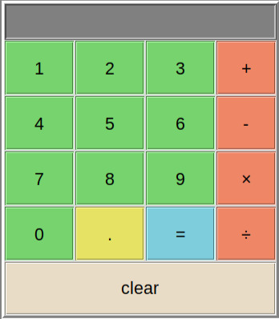

# Simple Tkinter Calculator

A basic calculator with a GUI, built using Python's Tkinter library. Created to learn GUI development for my to-do list v3 project, building on v2 progress.

## Features
- Basic arithmetic operations (addition, subtraction, multiplication, division)
- Decimal point support
- Error handling for syntax and division by zero
- Customizable button layout and styling

## Screenshot


## Requirements
- Python 3.6+
- Tkinter (pre-installed with most Python distributions; install via `pip install tk` if needed)

## Usage

1. Clone this repository:
    ```sh
    git clone https://github.com/yourusername/calculator.git
    cd calculator
    ```
2. Run the calculator:
    ```sh
    python calculator.py
    ```

## Notes

- Uses eval() for calculations (insecure for production—learning only).
- Logic inspired by Bro Code's YouTube tutorials, customized with my UI tweaks.
- Part of my journey from a CLI to-do list (v1, v2 in progress) to a Tkinter-based v3.


## About

By Hossein Garossian. Feedback on Tkinter UI or to-do list v3 ideas welcome!
